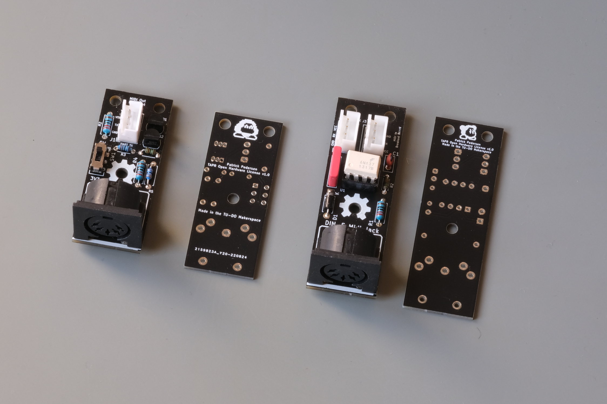
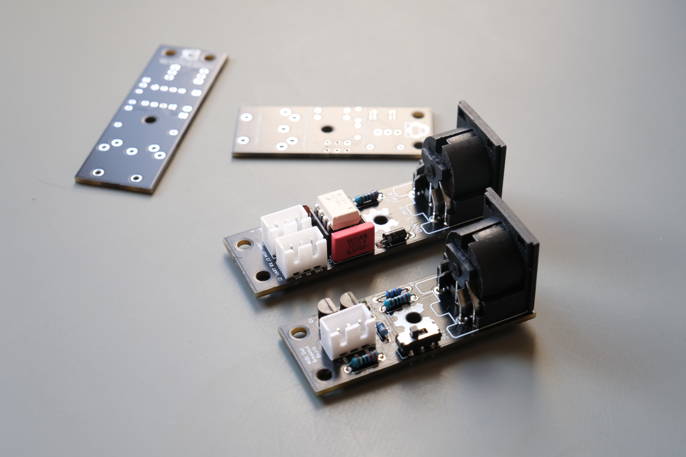
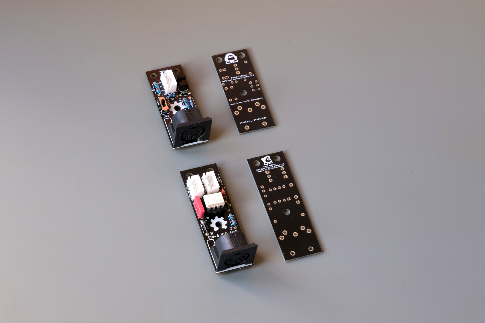

# Just another pair of MIDI breakout boards

This repository contains the KiCad files for a pair of MIDI breakout boards. There isn't anything particularly special about them, besides perhaps the fact that the MIDI OUT has a switch to select between 3.3V and 5V operation, as well as two BS170 MOSFETs to sink the current, rather than using buffer chips. Oh, and we use JST-XH connectors, because I hate those loose "DuPont" headers that allow you to plug things in the wrong way around! >:(

Further, one may also question the odd choice of some components, such as the 100nF film capacitor for voltage decoupling, instead of 100nF ceramic capacitor.
This really leads us to why these boards have even been made in first place. They're were really just intended as test boards to try out some [template MIDI schematics](https://github.com/TU-DO-Makerspace/KiCAD-MIDI-Templates) I designed for future projects that require MIDI support. The components were chosen according to the stuff we had lying around in our lab, hence the quirky choice of components and varying resistor footprints.

I'm still dumping this on GitHub, as we still have a few of these boards lying around and the repo serves as good documentation, but perhaps someone out there might also find them useful. After all, if you don't feel like using pricey film caps, you can always just pop in a ceramic one instead, the footprint is not that different.

## Noteworthy Features

MIDI IN:

 - Utilizes the faster 6N137 Optocoupler opposed to the more common 6N138
 - Uses a 15pF decoupling capacitor on the optocoupler's output for better noise immunity
 - Provides two parallel JST-XH connectors:
   - One to connect to the receiving device (eg. a MCU)
   - One to directly connect to a MIDI OUT board which gives you a MIDI THRU output

MIDI OUT:

 - Utilizes two BS170 MOSFETs to sink the current, rather than using buffer chips
 - Has a switch to select between 3.3V and 5V operation
 - Uses a JST XH connector to connect to the sending device (eg. a MCU, or a MIDI IN board for MIDI THRU)

Both boards are compliant with the MIDI Specification

## Ordering

The directories for the individual boards contain a "Gerbers" directory, which contains the gerber files for the respective board. You can use these to order the boards from your desired PCB manufacturer.

## Assembly

To make assembly easier, the directories for the individual boards contain a "bom" directory, which contains a 'ibom.html' file. This file can be opened in a browser and contains a a interactive PCB view that allows you to see which components go where, and what value they have.

It is recommended to keep this view open while assembling the board.

## More Pictures

## License

The following project is licensed under the [CERN-OHL-P v2 license](https://ohwr.org/cern_ohl_p_v2.pdf)

The boards on the pictures claim `TAPR Open Hardware License v1.0`, however, the KiCAD project has been updated to use the CERN-OHL-P v2 license.

Crediting is always appreciated, even for something as trivial as a pair of breakout boards!